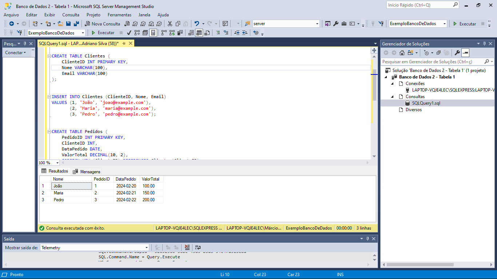
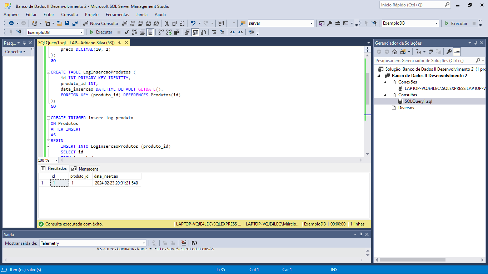

</h1>

  <a href="L I N K"> Live Preview</a>   |   
  <a href="#-projeto"> 🖥️ Projeto</a>   |   
  <a href="#-tecnologias">🚀 Tecnologias</a>

## Banco de Dados II - Proz

<h2>Desenvolvimento 1</h2>

Desenvolva um banco de dados e relacione tabelas através de chaves estrangeiras ou nomes de colunas iguais. Siga as instruções:
crie uma base de dados; 
crie tabelas nessa base de dados;
em cada tabela, adicione atributos;
insira dados em cada tabela;
utilize os comandos Joins para realizar consultas nas tabelas.

<h3>Screen.</h3>

<h4>Desenvolvimento 2</h4>

Crie um banco de dados, adicione tabelas e determine quais são os atributos de cada uma. Em seguida, execute um trigger que se relacione com algum comando, como insert, select, delete ou update.

<h5>Screen.</h5>

### Follow Me

[LinkedIN](https://www.linkedin.com/in/mads1974/)
